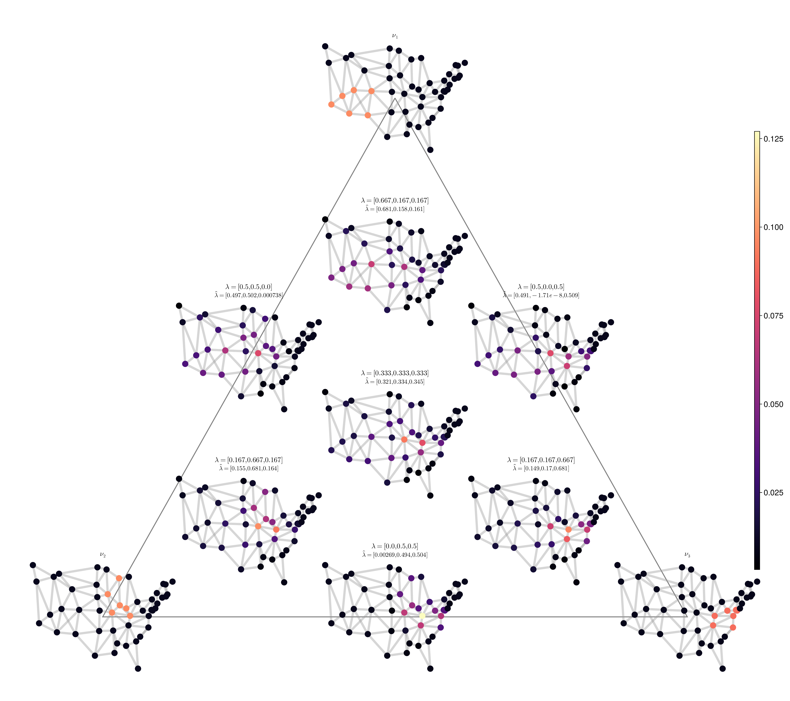

# GraphTransportation.jl

A Julia package for Wasserstein geometry on graphs, implementing the framework
of Erbar, Rumpf, Schmitzer, and Simon —
*Computation of optimal transport on discrete metric measure spaces*.

## Overview

Given a graph encoded as a Markov transition matrix `Q`, this package computes:

- **Geodesics** between probability measures on the graph via a
  Galerkin-discretised Chambolle-Pock primal-dual algorithm
- **Wasserstein barycenters** (Fréchet means) via gradient descent on the
  graph Wasserstein space
- **Barycentric coordinate recovery** by solving a quadratic programme on the
  Gram matrix of logarithmic maps
- **Entropy-regularised barycenters** via the Sinkhorn algorithm, with
  simplex-regression-based coordinate recovery

## Quick start

```julia
using GraphTransportation

# Two-point graph
Q = [0.0 1.0; 1.0 0.0]

# Two Dirac masses
μ = [2.0, 0.0]
ν = [0.0, 2.0]

# Geodesic and Wasserstein distance
geo  = discrete_transport(Q, μ, ν)
dist = transport_cost(Q, μ, ν)

# Barycenter of μ and ν with weights (0.75, 0.25)
M      = hcat(μ, ν)
bary   = barycenter(M, [0.75, 0.25], Q)

# Recover barycentric coordinates
coords = analysis(bary, M, Q)
```

## Graph constructors

Several standard graphs are provided in `CommonGraphs.jl`:

| Function | Graph |
|----------|-------|
| `triangle_markov_chain()` | 3-cycle |
| `square_markov_chain()` | 4-cycle |
| `cube_markov_chain()` | 3-cube (8 nodes) |
| `hypercube_markov_chain()` | 4-cube (16 nodes) |
| `grid_markov_chain(n)` | n×n grid |
| `triangular_prism_markov_chain()` | triangular prism (6 nodes) |
| `ma_house_markov_chain()` | MA state house district adjacency |

Each returns `(Q, π)` where `Q` is the row-stochastic transition matrix and
`π` is the stationary distribution.

## Barycentric coding model

The figure below shows the Barycentric Coding Model (BCM) on the 49-node
USA contiguous-states graph. Each sub-graph is a Wasserstein barycenter
whose position in the triangle reflects its recovered barycentric coordinates
with respect to three reference measures (corners).



## API reference

See the [Examples](examples.md) page for runnable experiment scripts, and the
[API Reference](api.md) page for full documentation of all exported functions.
