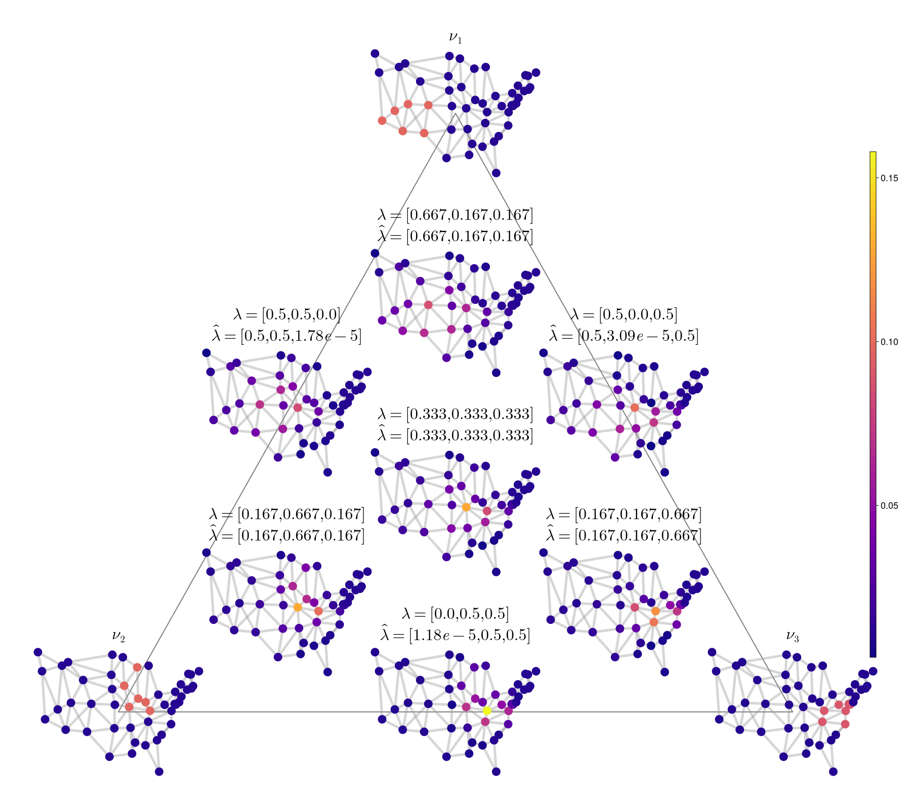

# GraphTransportation.jl

A Julia package for discrete transport geometry on graphs, implementing the framework
of Erbar, Rumpf, Schmitzer, and Simon —
*Computation of optimal transport on discrete metric measure spaces*.

## Overview

Given a graph encoded as a Markov transition matrix `Q` with stationary distribution
`π`, this package computes:

- **Geodesics** between probability measures on the graph, as a single
  second-order-cone program (`geodesic_socp`), or for strictly positive measures by
  Hamiltonian shooting (`log_map` / `exp_map`), which is faster and exact in time
- **Discrete transport barycenters** (Fréchet means) as one joint convex program
  solved to its global optimum (`barycenter_socp`)
- **Barycentric coordinate recovery** by solving a quadratic programme on the Gram
  matrix of the geodesics' initial potentials (`analyze_socp`, `analyze_shooting`)
- **Entropic optimal transport barycenters** via the Sinkhorn algorithm, with
  simplex-regression-based coordinate recovery

The original Galerkin-discretised Chambolle-Pock solver (`discrete_transport`) and the
gradient-descent barycenter (`barycenter`, `analysis`) remain available as the
reference implementation of the paper's algorithm, but the SOCP and shooting paths
are the recommended tools: orders of magnitude faster, with certified optimality for
barycenters and coordinate recovery that is exact at the synthesis resolution.

## Quick start

```julia
using GraphTransportation

# Two-point graph with its stationary distribution
Q = [0.0 1.0; 1.0 0.0]
π = [0.5, 0.5]
G = MarkovGraph(Q, π)

# Two Dirac masses (densities with respect to π)
μ = [2.0, 0.0]
ν = [0.0, 2.0]

# Discrete transport geodesic; W2 is the squared distance
geo = geodesic_socp(G, μ, ν; N=20)
geo.W2, geo.ρ

# Barycenter of μ and ν with weights (0.75, 0.25), and its recovered coordinates
bary, J, _ = barycenter_socp(G, [μ, ν], [0.75, 0.25]; N=20)
coords     = analyze_socp(G, bary, [μ, ν]; N=20)

# For strictly positive measures, the shooting maps give exact-in-time geodesics
ρ0 = [1.2, 0.8]; ρ1 = [0.6, 1.4]
tangent = log_map(G, ρ0, ρ1)      # (; φ0, m0, W2, iters, residual)
exp_map(G, ρ0, tangent.φ0) ≈ ρ1   # round trip
```

## Graph constructors

Several standard graphs are provided in `CommonGraphs.jl`:

| Function | Graph |
|----------|-------|
| `triangle_markov_chain()` | 3-cycle |
| `square_markov_chain()` | 4-cycle |
| `cube_markov_chain()` | 3-cube (8 nodes) |
| `hypercube_markov_chain()` | 4-cube (16 nodes) |
| `grid_markov_chain(n)` | n×n grid |
| `triangular_prism_markov_chain()` | triangular prism (6 nodes) |
| `ma_house_markov_chain()` | MA state house district adjacency |

Each returns `(Q, π)` where `Q` is the row-stochastic transition matrix and
`π` is the stationary distribution.

## Barycentric coding model

The figure below shows the Barycentric Coding Model (BCM) on the 49-node
USA contiguous-states graph. Each sub-graph is a discrete transport barycenter
(`barycenter_socp`) whose position in the triangle reflects its recovered
barycentric coordinates (`analyze_socp`) with respect to three reference measures
(corners).



## API reference

See the [Examples](examples.md) page for runnable experiment scripts, and the
[API Reference](api.md) page for full documentation of all exported functions.
