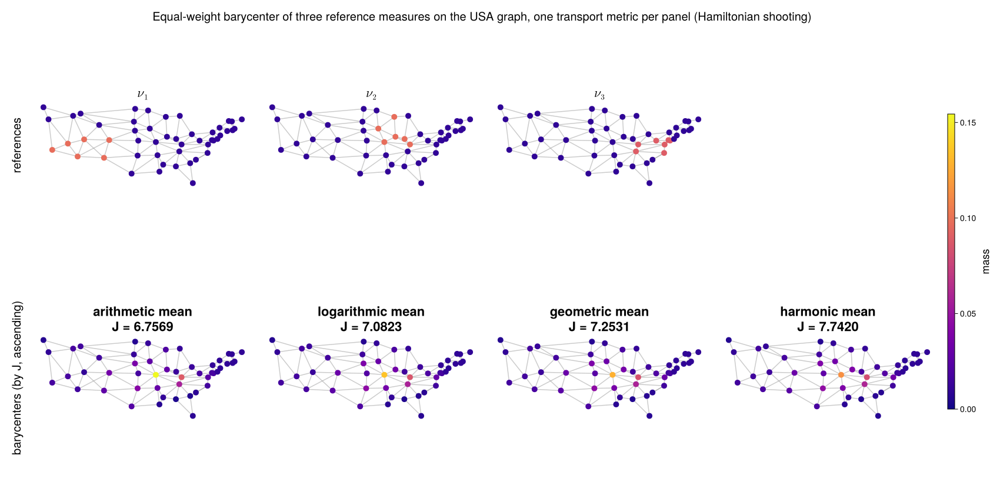

# GraphTransportation.jl

Optimal transport geometry for probability measures on graphs. A graph is given as a
reversible Markov chain; the package equips the measures on it with the discrete
transport metric of Maas and of Chow, Huang, Li and Zhou, for any admissible mean, and
computes geodesics, barycenters and barycentric coordinates in that geometry. The
literature behind each part is collected on the [References](citations.md) page.

## Overview

Given a graph encoded as a Markov transition matrix `Q` with stationary distribution
`π`, this package computes:

- **Geodesics** between probability measures on the graph, as a single
  second-order-cone program (`geodesic`), or for strictly positive measures by
  Hamiltonian shooting (`log_map` / `exp_map`), which is faster and exact in time
- **Discrete transport barycenters** (Fréchet means) as one joint convex program
  solved to its global optimum (`barycenter`)
- **Barycentric coordinate recovery** by solving a quadratic programme on the Gram
  matrix of the geodesics' initial potentials (`analysis`, `analysis(...; method=:shooting)`)
- **Entropic optimal transport barycenters** via the Sinkhorn algorithm, with
  simplex-regression-based coordinate recovery

Every function takes `method=:socp` (default), `:shooting`, or `:chambolle_pock`. The
last is the paper's Galerkin-discretized Chambolle-Pock solver with gradient-descent
barycenters, kept as the reference implementation; the SOCP and shooting paths are the
recommended tools: orders of magnitude faster, with certified optimality for
barycenters and coordinate recovery that is exact at the synthesis resolution.

## Quick start

```julia
using GraphTransportation

# Two-point graph with its stationary distribution
Q = [0.0 1.0; 1.0 0.0]
π = [0.5, 0.5]
G = MarkovGraph(Q, π)

# Two Dirac masses (densities with respect to π)
μ = [2.0, 0.0]
ν = [0.0, 2.0]

# Discrete transport geodesic; W2 is the squared distance
geo = geodesic(G, μ, ν; N=20)            # method=:socp by default
geo.W2, geo.ρ

# Barycenter of μ and ν with weights (0.75, 0.25), and its recovered coordinates
bary, J, _ = barycenter(G, [μ, ν], [0.75, 0.25]; N=20)
coords     = analysis(G, bary, [μ, ν]; N=20)

# For strictly positive measures, Hamiltonian shooting is faster and exact in time
ρ0 = [1.2, 0.8]; ρ1 = [0.6, 1.4]
geodesic(G, ρ0, ρ1; method=:shooting).W2
tangent = log_map(G, ρ0, ρ1)      # the underlying exp/log maps are also exported
exp_map(G, ρ0, tangent.φ0) ≈ ρ1   # round trip
```

## Graph constructors

Several standard graphs are provided in `CommonGraphs.jl`:

| Function | Graph |
|----------|-------|
| `triangle_markov_chain()` | 3-cycle |
| `square_markov_chain()` | 4-cycle |
| `cube_markov_chain()` | 3-cube (8 nodes) |
| `hypercube_markov_chain()` | 4-cube (16 nodes) |
| `grid_markov_chain(n)` | n×n grid |
| `triangular_prism_markov_chain()` | triangular prism (6 nodes) |
| `ma_house_markov_chain()` | MA state house district adjacency |

Each returns `(Q, π)` where `Q` is the row-stochastic transition matrix and
`π` is the stationary distribution.

## Barycentric coding model

The figure below shows the Barycentric Coding Model (BCM) on the 49-node
USA contiguous-states graph. Each sub-graph is a discrete transport barycenter
(`barycenter`) whose position in the triangle reflects its recovered
barycentric coordinates (`analysis`) with respect to three reference measures
(corners).


## Admissible means

The transport metric depends on a choice of *mobility* `θ(s, t)`, an admissible mean
(symmetric, 1-homogeneous, concave; see `AdmissibleMean`). It is part of the geometry,
so it is set on the graph: `MarkovGraph(Q, π; mean=HarmonicMean())`, or
`MarkovGraph(G; mean=QuadLogMean(8))` to re-equip an existing graph. Every geodesic,
barycenter and analysis computed from that graph then uses the same metric, which is
what keeps synthesis and analysis consistent.

| mean | `θ(s, t)` | notes |
|---|---|---|
| `GeometricMean()` (default) | `√(st)` | Erbar et al. 2020's computational choice |
| `ArithmeticMean()` | `(s+t)/2` | the only one with `θ(0, t) ≠ 0`: mass can leave an empty node, so paths may reach the boundary; prefer `method=:socp` there |
| `HarmonicMean()` | `2st/(s+t)` | smallest of the four, so its distances are the largest |
| `LogarithmicMean()` | `(s−t)/(ln s − ln t)` | the mean for which the heat flow is the entropy gradient flow (Maas 2011); no conic form, so `method=:shooting` |
| `QuadLogMean(K)` | Gauss–Legendre approximation of the logarithmic mean | the SOCP's representation of it, `K` power cones per edge and time step; `K=8` is accurate to 1e-10 |

For all `s, t > 0`: harmonic ≤ geometric ≤ logarithmic ≤ arithmetic, so transport is
cheapest under the arithmetic mean and most expensive under the harmonic one. `method=:socp`
and `method=:shooting` honor every mean (the SOCP needs `QuadLogMean` for the
logarithmic one); `method=:chambolle_pock` supports only the geometric mean and errors
otherwise.

The figure shows the equal-weight barycenter of the same three reference measures on
the USA graph under the geometric, harmonic and logarithmic means, computed by
`barycenter(G, refs, λ; method=:shooting)` (`src/experiments/MeansComparison.jl`; 12 to
18 descent iterations and about a minute per mean). The panels are ordered by the
variance `J = Σᵢ λᵢ W²(νᵢ, ν)`, which orders exactly as the means do. The barycenters
differ modestly, by 0.05 to 0.14 in the π-weighted norm, with the logarithmic mean
concentrating mass the most and the harmonic mean spreading it the most. The joint SOCP
reproduces the geometric and harmonic barycenters at N=32 in a few seconds each, but its
quadrature-log program stalls in Clarabel for N ≥ 8 on this graph (reported as an error
rather than a stale iterate), which is what the shooting barycenter is for.



## API reference

See the [Examples](examples.md) page for runnable experiment scripts, and the
[API Reference](api.md) page for full documentation of all exported functions.
